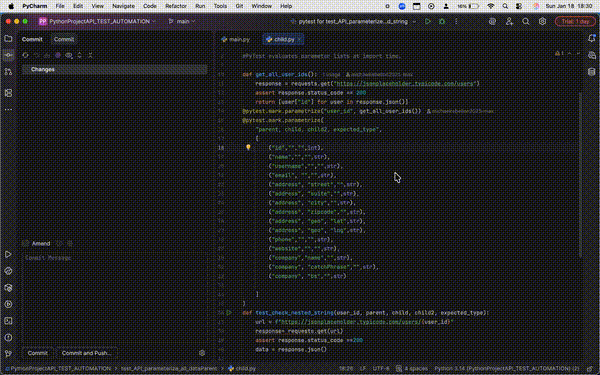

# Python Project: API Test Automation

## 🚀 Project Overview

This project demonstrates a full suite of automated API tests using Python, Pytest, and Requests.  
It includes **parameterized tests**, positive and negative scenarios, and nested JSON validation for multiple endpoints.  

This is a portfolio-ready showcase of professional QA automation skills.

---

## 📸 Demo Video



> This GIF shows the full API test suite running, including multiple user endpoint validations, positive/negative tests, and nested JSON checks.

---

## 🛠 Tech Stack

- **Python 3.x** – programming language  
- **Pytest** – test framework  
- **Requests** – API calls and response validation  
- **Git/GitHub** – version control and repository management  
- **PyCharm** – IDE for development and debugging  

---

## ⚡ Features

- Parameterized tests for multiple user IDs  
- Positive tests (valid endpoints, correct response codes, JSON validation)  
- Negative tests (invalid IDs, missing fields, unauthorized requests)  
- Nested JSON field validation (address, company, geo fields, etc.)  
- Assertions for types, non-empty values, and correct formatting  
- Clean, reusable, and maintainable test structure  

---

## 📝 Quick Start

1. **Clone the repository**
```bash
git clone https://github.com/michaelrebellon2025-max/PythonProjectAPI_TEST_AUTOMATION.git
cd PythonProjectAPI_TEST_AUTOMATION
````

2. **Create and activate a virtual environment**

```bash
python3 -m venv venv
source venv/bin/activate   # macOS/Linux
# .\venv\Scripts\activate  # Windows
```

3. **Install dependencies**

```bash
pip install pytest requests
```

4. **Run the test suite**

```bash
pytest -v
```

5. **View results**

* Tests will validate API responses, nested fields, and positive/negative scenarios.

---

## 🏆 Highlights

* 150+ tests automated with **100% passing** results
* Comprehensive API coverage including **user endpoints, nested JSON fields, and error handling**
* Portfolio-ready, recruiter-friendly demonstration of QA automation skills
